<a name="readme-top"></a>

<!-- PROJECT LOGO -->
<br />
<div align="center">
  <a href="https://github.com/othneildrew/Best-README-Template">
    
  </a>

  <h3 align="center">Task Management</h3>

  <p align="center">
    his website provides powerful tools for managing daily and monthly tasks, helping users achieve efficiency and organization in their daily and professional lives
    <br />
    <h5> Tolse </h5>
    <a href="https://react.dev/">React.js</a>
    <a href="https://firebase.google.com/">Firebase</a>
    <a href="https://fontawesome.com">Fontawesome</a>
    <a href="https://getbootstrap.com/">Bootstrap</a>
    <br />
    <a href="https://github.com/othneildrew/Best-README-Template">View Demo</a>
    <br />

  </p>
</div>

## Live Demo [Project URL](https://new-project-level2.web.app/)

<!-- ABOUT THE PROJECT -->
## About Task Management Project

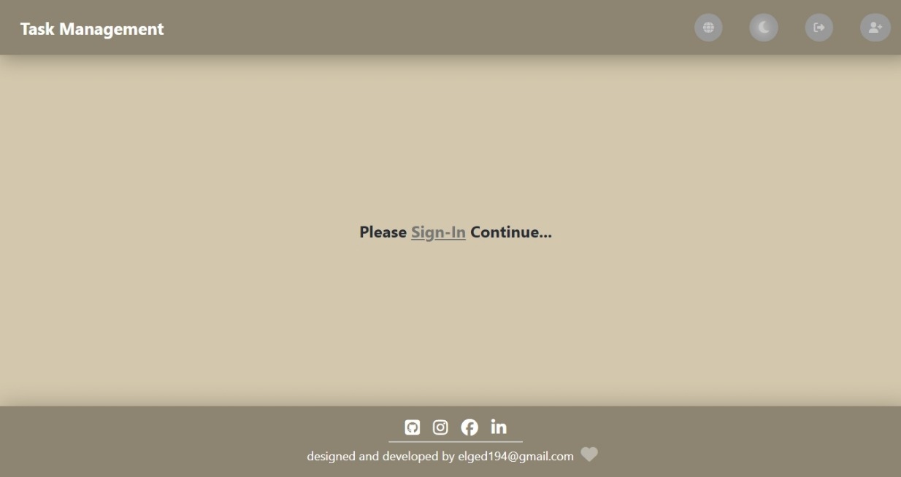
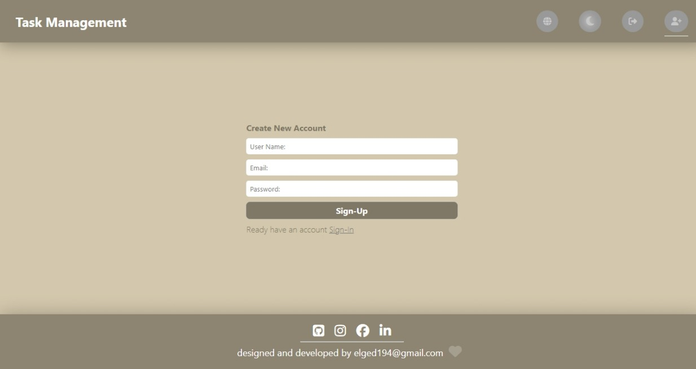
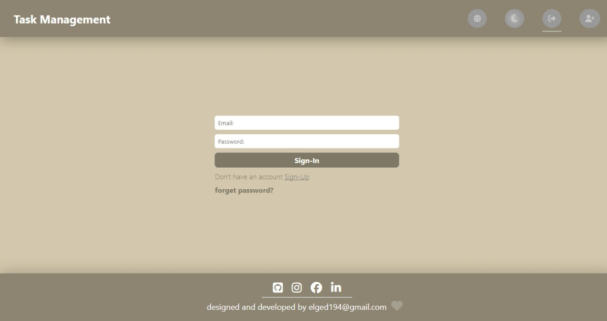
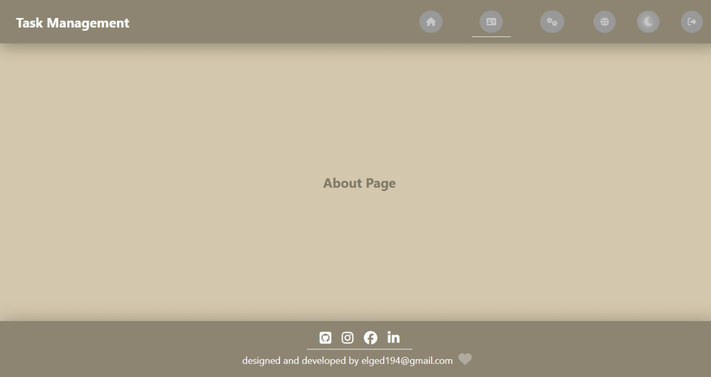
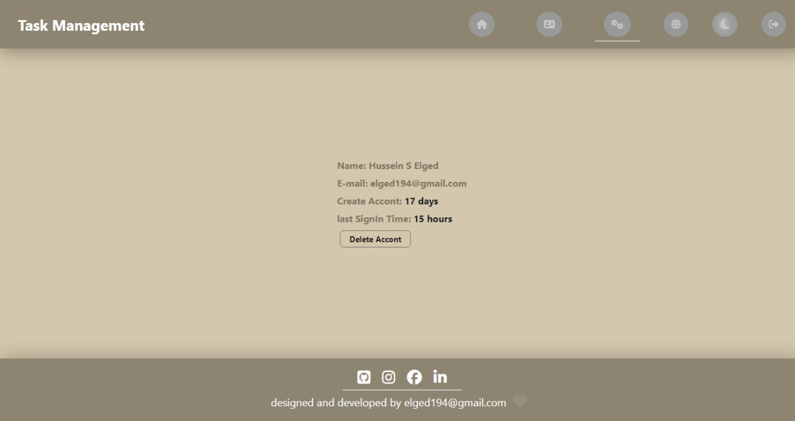
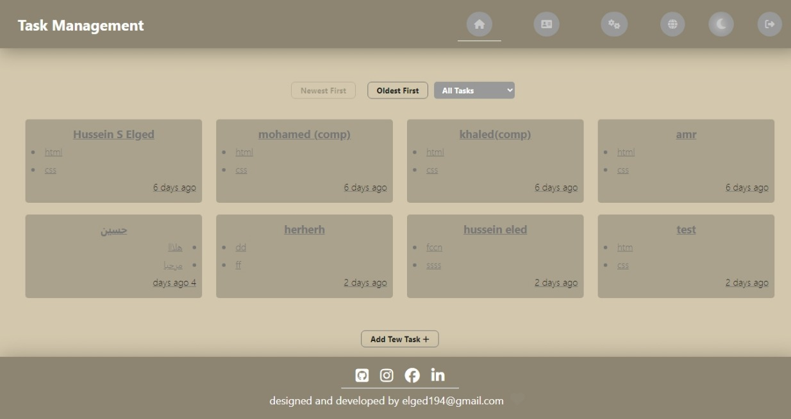
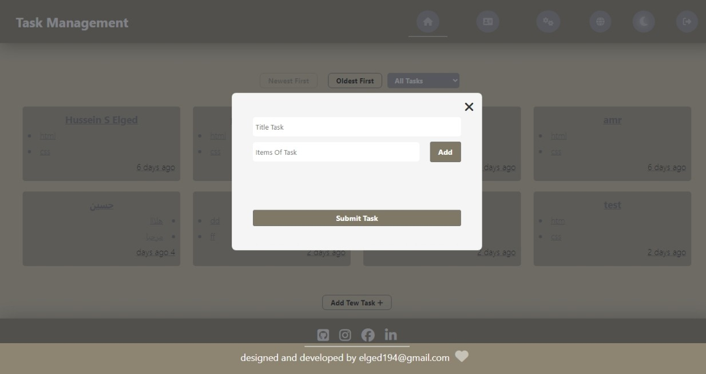
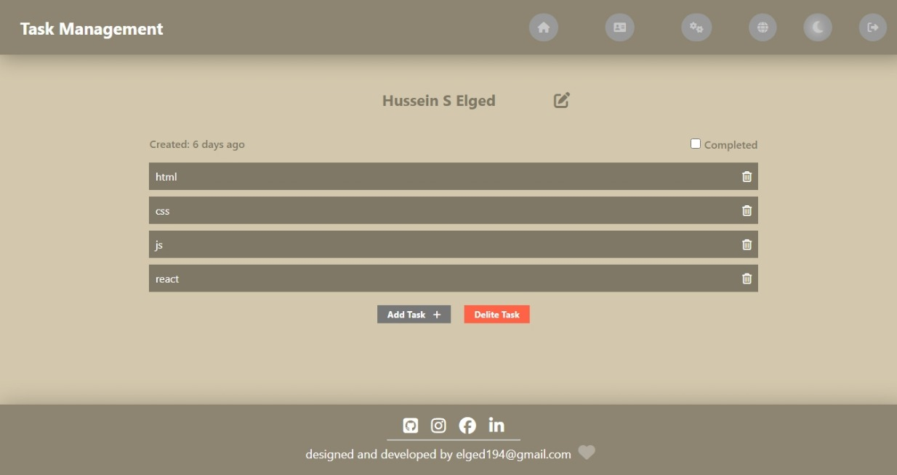
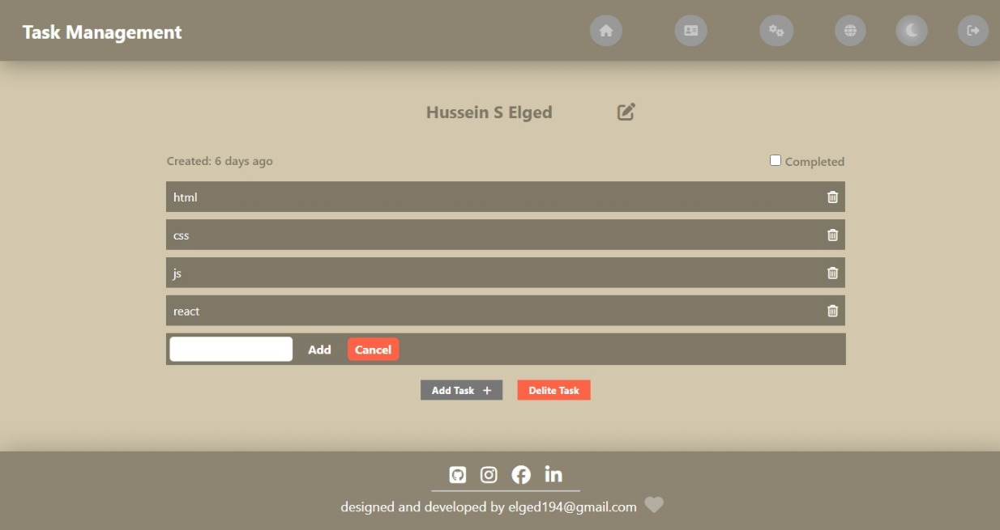
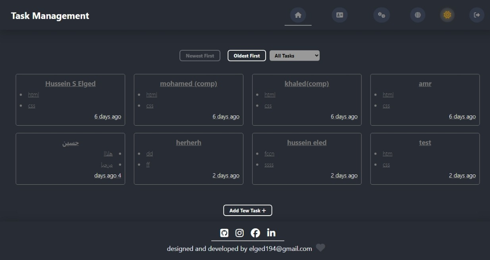
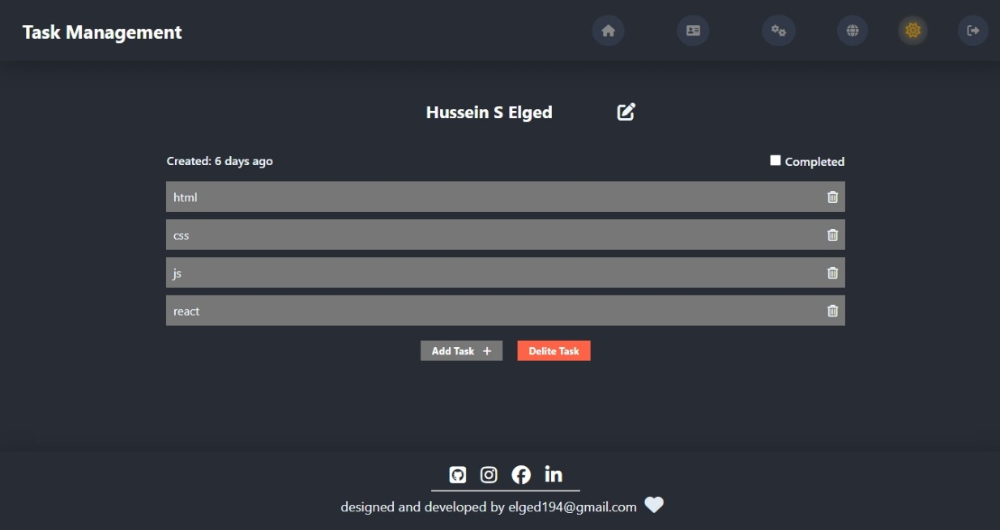

The website that manages daily and monthly tasks and allows for saving and editing data is a type of personal task management application aimed at helping individuals organize their daily and monthly activities effectively. This website offers many features and functions that assist users in achieving their goals and managing their time better.

Here are some key features of this website:

- Task Creation: The website allows users to create new tasks to be completed in the current day or month.

- Task Scheduling: Users can specify dates and times for completing tasks, whether they are daily or monthly.

- Task Categorization: The website enables users to categorize tasks according to their priorities or different categories for easier organization.

- Progress Tracking: The website allows users to track progress in completing tasks and record relevant data such as dates and notes.

- Data Storage and Editing: The website provides a secure database for storing all tasks and changes made by users, allowing them to access and edit them at any time.

- User-Friendly Interface: The website designs a simple and easy-to-use user interface to ensure a comfortable experience for users of all levels.

In summary, this website provides powerful tools for managing daily and monthly tasks, helping users achieve efficiency and organization in their daily and professional lives.

موقع الويب الذي يدير المهام اليومية والشهرية ويسمح بحفظ البيانات وتعديلها هو نوع من تطبيقات إدارة المهام الشخصية التي تهدف إلى مساعدة الأفراد في تنظيم أنشطتهم اليومية والشهرية بطريقة فعالة. يوفر هذا الموقع العديد من الميزات والوظائف التي تساعد المستخدمين على تحقيق أهدافهم وإدارة وقتهم بشكل أفضل.

ليك بعض السمات والميزات الرئيسية لهذا الموقع:

- **إنشاء المهام**: يتيح الموقع للمستخدمين إنشاء مهام جديدة للقيام بها في اليوم أو الشهر الحالي.

- **جدولة المهام**: يمكن للمستخدمين تحديد تواريخ وأوقات محددة لإكمال المهام، سواء كانت يومية أو شهرية.

- **تصنيف المهام**: يتيح الموقع للمستخدمين تصنيف المهام بحسب أولوياتها أو الفئات المختلفة لتسهيل التنظيم.

- **تتبع التقدم**: يسمح الموقع للمستخدمين بتتبع التقدم في إنجاز المهام وتسجيل البيانات ذات الصلة مثل التواريخ والملاحظات.

- **تخزين البيانات والتعديل**: يوفر الموقع قاعدة بيانات آمنة لحفظ جميع المهام والتغييرات التي يقوم بها المستخدمون، بحيث يمكنهم الوصول إليها وتعديلها في أي وقت.

- **واجهة سهلة الاستخدام**: يصمم الموقع واجهة مستخدم بسيطة وسهلة الاستخدام لضمان تجربة مريحة للمستخدمين من جميع المستويات.

باختصار، يوفر هذا الموقع الويب أدوات قوية لإدارة المهام اليومية والشهرية، مما يساعد المستخدمين على تحقيق الفعالية والتنظيم في حياتهم اليومية والمهنية.

<!-- -------------------------------------------- -->

<p align="right">(<a href="#readme-top">back to top</a>)</p>

### Libraries

- firebase
- react-firebase-hook
- react-helmet-async
- react-i18next
- react-loading
- react-moment
- react-router-dom

<p align="right">(<a href="#readme-top">back to top</a>)</p>

<!-- GETTING STARTED -->

## Getting Started

To launch the project, follow these steps.

### Prerequisites

Make sure you have Node.js installed on your computer to verify. Run .

- npm

```sh
node -v
```

Downloads [https://nodejs.org/en/download/](https://nodejs.org/en/download/)

### Installation

1. Install NPM packages
   ```sh
   npm install
   ```
1. Install NPM packages
   ```sh
   npm start
   ```
   <!-- USAGE EXAMPLES -->

## Usage

1. You must create an account using an email address.
2. A confirmation message will be sent.
3. Log in.

## Contact

Your Name - [elged194@gmail.com](https://gmail.com) - elged194@gmail.com
<br />
linkedin - [https://www.linkedin.com/in/hussein-sadiq-elged/](https://www.linkedin.com/in/hussein-sadiq-elged/)
<br />
Project Link: [https://github.com/elged194/React_Level2-main](https://github.com/elged194/React_Level2-main)

<p align="right">(<a href="#readme-top">back to top</a>)</p>
